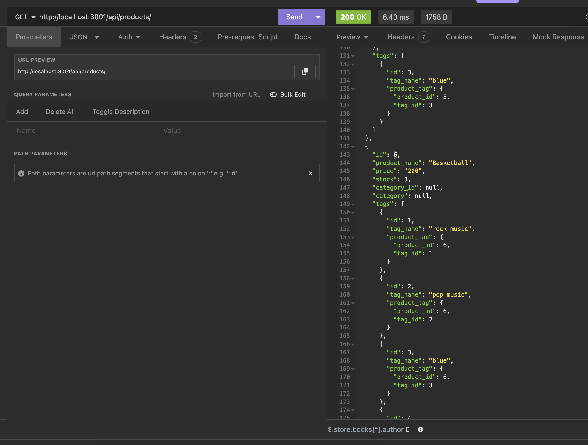
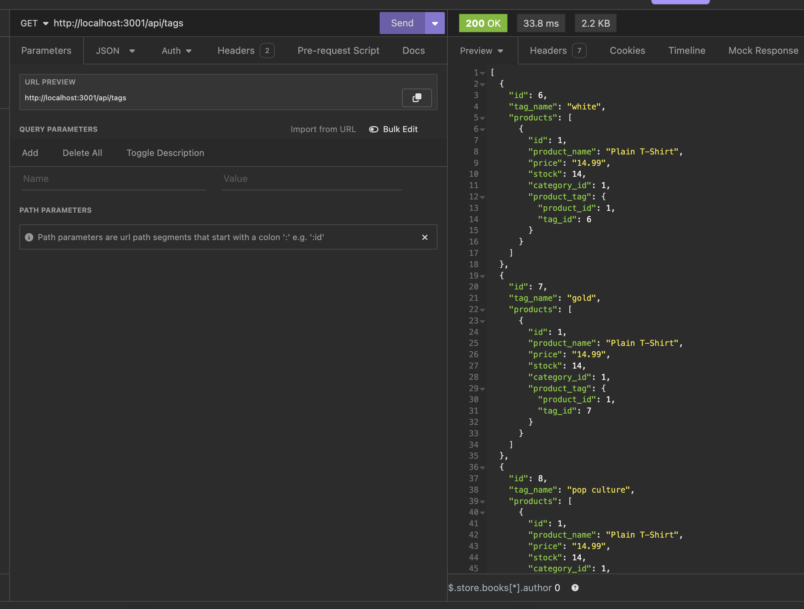
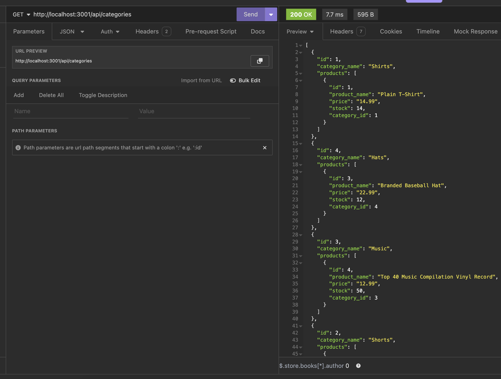

# e-commerce-back-end
## Description
* This project is a backend for an e-commerce website, built with Express.js, Sequelize, and PostgreSQL. It provides a RESTful API to manage categories, products, and tags.

## Installation
* Install npm packages by running this code in the terminal ``` npm install ```
* Set up the database by runnning this code in the terminal ``` psql -U postgres ``` and enter postgres password
* Run schema sql file by running this code in the terminal ``` \i schema.sql ``` 

## Usage
* To start the application run this code in the terminal ``` npm run start```
* The server will be running at `http://localhost:3001`
* Use Insomnia or any other API client to test the API endpoints.

## API Endpoints
* /api/categories/
* /api/products/
* /api/tags/

## Technologies Used
* Node.js
* Express.js
* Sequelize
* Dotenv
* PostgreSQL

## Insomnia Testing
* 
* 
* 

## Links
* [Github Repository](https://github.com/veyselarslan12/e-commerce-back-end)
* [Example Test Video Link](https://drive.google.com/file/d/1LapBHDG8ZZOpc7q_K_Ji-tFh_EfB2IR3/view)